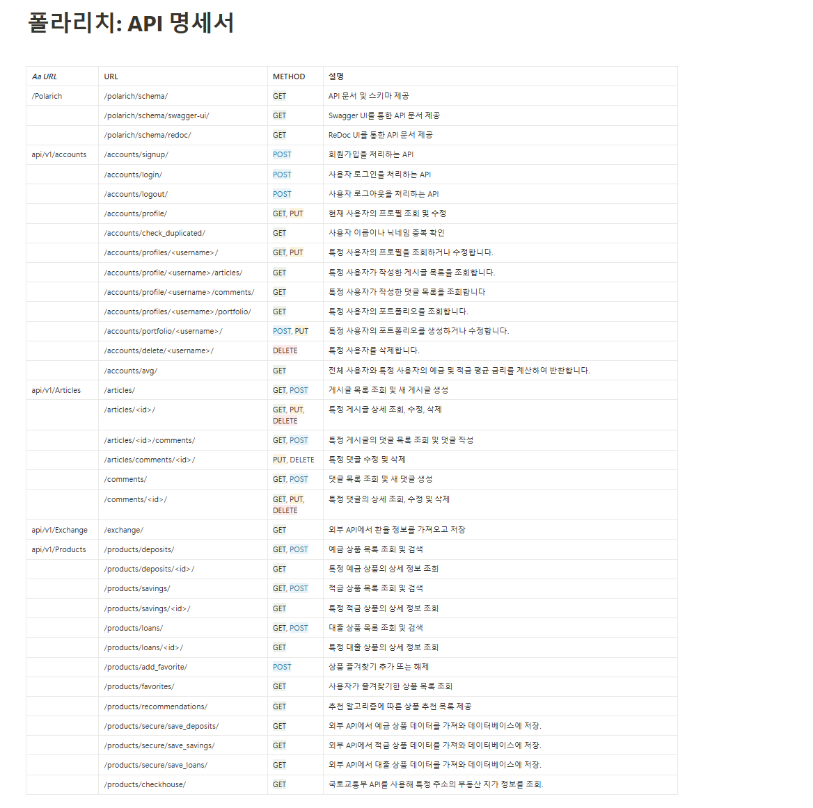
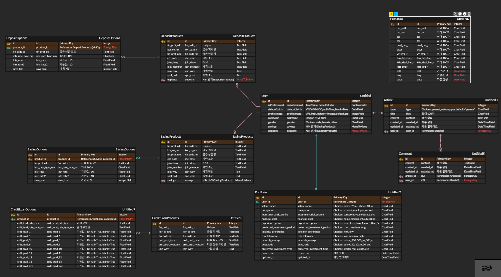

https://www.notion.so/Polarich-1319f6a8041980a5bfc7c163bdcf4680

## 💡 개요
- 진행기간 : 2024.11.18. ~ 2024.11.27.
- 주제 :  예적금 상품 조회 및 추천 서비스
- 서비스명 : 폴라리치(PolaRich)
<aside>
✨ **넓고 어두운 금융의 세계, 폴라리치는 당신의 길잡이별로 빛나겠습니다.**

## ✨ 기획 배경
- 북극성(Polaris) +부자(rich)
- 어두운 밤길을 찾는데 도움을 주는 북극성처럼, 부자가 되는 길인 금융 정보를 찾는데 도움을 주는 서비스 의미
</aside>

 

##  ⚙️ 기술 스택

### Frontend
  

### Backend
 
 

### Environment
      

### 사이트 구성

- 문서 관련
1. Main 페이지 
    - 페이지 스크롤로 페이지 소개
    - 상단바: 회원 정보, 통합 검색, 왼쪽으로 확장되는 페이지

2. 커뮤니티 기능능

  2-1. 자유 게시판
  - 기본 CRUD 구현
  - 댓글 및 이미지 첨부 기능 구현

  2-2. 금융 Q&A 게시판

  - 권한을 가진 사용자 (IsProfessional)만 답변이 가능하도록 구현
  - AI를 활용한 자동 답변
  2-3. 칼럼 게시판
  - 권한을 가진 사용자 (IsProfessional)만 답변이 가능하도록 구현
  - 역할 자체는 일반 게시판과 다르지 않으나, 추후 구현할 기능에서 관련 게시글의 링크를 제공하는 역할

1. 필수 금융 서비스
    1. 내 주변 은행 찾기
    2. 알맞은 금융상품 추천하기
    3. 환율 계산

2. 추가 금융 서비스: 금융사기 안전구역
    1. 대출 조건 비교 >> 이 대출 사기대출인가?
        - 이율이 낮고, 출처가 문자메시지 등 조건이면 스미싱 사기 의심
        - 이율이 너무 높고, 액수가 상대적 저액이면 30-50 사기 의심
    2. 깡통 전세 계산기

- 유저 정보 관련
    1. 회원 가입 페이지
        - 회원 가입 및 로그인, 로그아웃과 같은 기본적인 유저 기능은 RUST_AUTH 라이브러리 사용
  
    2. 회원 정보 수정 페이지
        1. 탈퇴, 수정, 비밀번호 수정과 같은 기본적인 CRUD
        2. 프로필 사진
        3. 금융 상품 정보: 예적금, 대출 상품들의 리스트 보기와 상세 제품 보기.
        4. 차트 : 내가 담은 상품들의 금리와, 전체 상품들의 금리를 비교분석 할 수 있는 가로 바 차트 제공
        5. 금융 별무리록: 즐겨찾기 상품, 포트폴리오: 추천 시스템과 연계, 프로필 페이지에서 관리.

### 팀원 정보 및 역할분담.
|   팀원    | 역할 |
|--------|-------|
|김한길| Front-end, 로그인 페이지 구성, 회원가입 페이지 구성, 환율 페이지 기획 및 구성, 덤프데이터 생성 |
|편정웅| Front-end, 프론트엔드, ARTICLE 관련 페이지 기획 및 구성, 프로필: 포트폴리오 및 추천 시스템 기획 및 구성, 메인 페이지 및 상단바 디자인 전반 기획 및 구성, 예적금 상품목록 CRUD 기획 및 구성, 금융사기 안전구역 페이지 기획 및 구성, |

 

## 일정
### Backend
| 날짜       | 주요 작업 내용                                        |
|------------|------------------------------------------------------|
| 11/18      | 프로젝트 생성 및 유저, 게시글 CRUD 구현, 추천 시스템 기획 |
| 11/19      | 환율 백엔드 구현, 포트폴리오 기반 추천 시스템 백엔드 구현, 즐겨찾기 시스템 구현 |
| 11/20      | 상품 및 옵션 저장 백엔드 로직 추가                    |
| 11/21      | 상품 리스트 및 디테일 백엔드 구현, 추천 시스템 1/4 구현 |
| 11/22      | 추천 시스템 구현 완료                                 |
| 11/25      | 차트 데이터 전달을 위한 로직 추가                     |
| 11/26      | 전세사기 방지 구역을 위한 API 요청 처리 기능 추가       |

### Frontend
| 날짜       | 주요 작업 내용                                        |
|------------|------------------------------------------------------|
| 11/19      | 로그인 및 회원가입 페이지 생성                        |
| 11/20      | 메인페이지, 상단바 구성, 커뮤니티 CRUD 연결            |
| 11/21      | 댓글 관련 로직 추가, 환율 페이지 생성                 |
| 11/22      | 프로필 페이지, 포트폴리오 페이지 생성                 |
| 11/23      | 추천 페이지 구현                                      |
| 11/24      | 지도 기반 은행 탐색 페이지 구현                       |
| 11/25      | 금융사기 방지 구역 - 전세사기 페이지 구현, 차트 기반 금리 비교 구현 |
| 11/26      | 금융사기 방지 구역 - 부동산 페이지 구현               |

 

## 📄 API DOCS

!https://acute-muenster-1a8.notion.site/API-76df7360d8944b0bae06e976d8dd4e64 

## ERD

## 🖇️금융 상품 추천 알고리즘
 ## 사용자 포트폴리오 기반 구현
   
   1. 사용자가 추천 페이지에 접근하면 투자 성향, 직업, 소득, 재무 목표 등을 작성하는 포트폴리오 페이지로 이동
   2. 사용자가 포트폴리오를 제출할 시, 포트폴리오를 백엔드에 저장하며, 기존 유저에 대한 포트폴리오와, 유저의 성향 기반으로 즐겨찾기가 높은 상품을 추천
   3. 유저의 선택 가능 옵선 : 1. 가장 즐겨찾기가 많이 된 상품, 2. 같은 재무목표를 가진 사람들이 선호하는 상품, 3. 같은 직업이 선호하는 상품 4. 같은 나이대의 사람들이 선호하는 상품 목록

## 🤖 생성형 AI 활용 
  ### 프로젝트 진행 과정
  ### 서비스 내부
    1. 금융 Q&A 섹션의 문제점 : 이용자가 없다면 실제 발표 과정에서 보여줄 것이 없고, 일반 게시판과 다르지 않음.
    2. 해당 문제를, AI의 자동 답변을 통해 해결하고자 함
    3. 구현방식: 유저가 Q&A 섹션에 질문을 남김 >> POST 요청으로 해당 글이 생성될 때, CHAT GPT API를 통해 자동으로 1번 답변에 AI의 답변을 요청 >> 요청 반환 시, 1번 답변으로 AI의 답변이 들어감
    4. 프롬프트 엔지니어링
      - AI의 페르소나 규정 : 소비자를 위해 답변을 달아주는 금융 질문 게시판의 전문가
      - 답변 형식 규정 : 마크다운 문법을 사용하고, 주제별로 섹션을 구분함으로써 소비자가 더 정돈된 답변을 얻을 수 있도록 유도
      - 역할 명확화 : 답변 마지막 부분에 AI 답변의 한계를 명확히 하고, 주제와 맞는 정보를 획득할 수 있는 공식 링크를 안내함으로써, AI 답변으로 인한 문제 경감 및 소비자에게 다양한 탐색 경로 제공
    5. 내부 서비스와 연계
      - 답변을 제시할 때, 칼럼의 일부 제목 데이터를 함께 연계해서 전송하고, 관련이 있는 질문일 시 해당 칼럼의 링크를 제공하도록 함.
      - 단순히 소비자가 챗GPT를 폴라리치에서 사용하는 것을 넘어, 폴라리치에서만 사용할 수 있는 고유의 GPT를 구현하도록 함.

 

## 느낀 점
| 팀원     | 소감 |
|-----------|--------|
|편정웅 | GPT를 프로젝트 과정에서 사용하는 것은 당연하다, 안쓰거나 덜쓴다는 마인드가 아니라, 잘 쓴다는 마인드로 접근하자는 교훈을 배웠습니다. GPT를 많이 쓰면서 못쓸 때와, 잘 쓸때의 구현 차이점, 오류에 발목잡히는 시간이 크게 줄어듦을 알 수 있었습니다.👏🏻 향후 프로젝트에서도 GPT 사용에 있어선 이번 프로젝트에 설정한 룰을 지켜야 겠단 생각을 했습니다. 컴포넌트의 재사용은 다른 프로젝트들의 회고를 보고 어느정도 구현하려 노력했지만, 작명 규칙 등에서 더 세심한 신경을 썼어야 하는 아쉬움이 크게 남습니다. GIT 충돌로 인해 많은 고생을 했습니다. 잦은 커밋, 형상관리를 배우는 것이 관통 프로젝트에서 큰 자산이 될 수 있다 생각하였는데, 이를 배우지 못한 점을 보충해야 할 것 같습니다. 한 학기간 저의 길잡이별이 되어주신 교수님 및, 밤새가며 노력해준 페어 한길이형, 1반 모두에게 감사드립니다.✨
|김한길| 정말 쌩 노베이스인 저로서는 SSAFY 시작부터 끝까지 어렵지 않았던 순간이 없었습니다. 거대하게 느껴졌던 개발자의 모습이 한층 더 작아지는 계기가 되었습니다. 약 4개월 동안 배운 것으로 처음 프로젝트를 만든 것이 신기했고, 이는 새로운 목표를 세우는 계기가 되었습니다. 반에서도 GPT를 써야 할지 말아야 할지에 대한 갑론을박이 있었지만, 이제는 그에 대한 답이 선명해졌습니다.   귀로만 들었던 “이제 개발자는 누가 GPT를 잘 쓰느냐의 싸움이다”라는 말을 몸소 깨닫게 되는 시간이었습니다. 이제는 제 생각 속 이미지를 GPT를 통해 쉽고 빠르게, 그리고 완벽하게 프론트를 만들 수 있다는 가능성을 느꼈고, 심지어 백엔드도 어느 정도 할 수 있겠다는 자신감이 생겼습니다.   왜 IT에서는 협업과 소통을 중요하게 여기는지를 알게 되었고, 소통이 자주 필요하며, 소통의 기술도 중요한 덕목이라는 생각이 들었습니다. 또한, Git 충돌을 경험하면서 Git에 대한 공부가 더 필요하다는 점을 깨달았고, 방학 동안 Vue.js, React.js, Figma를 공부하여 다음 프로젝트에서는 프론트엔드로서 부족함이 없는 사람이 되고 싶다는 목표가 생겼습니다.  여러 고민을 해결해 주고 도움을 주신 교수님, 그리고 알게 모르게 뒤에서 서포트해 주신 프로님, 다양한 개성과 유쾌함을 가진 반 친구들 덕분에 1학기를 즐겁게 보낼 수 있었습니다. 이 자리를 빌려 진심으로 감사의 마음을 전합니다.